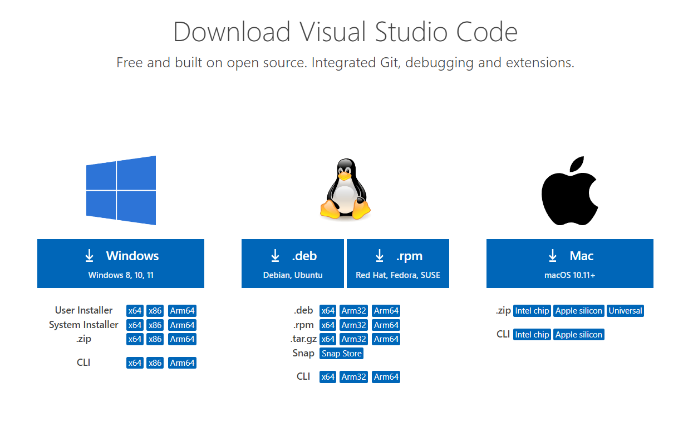
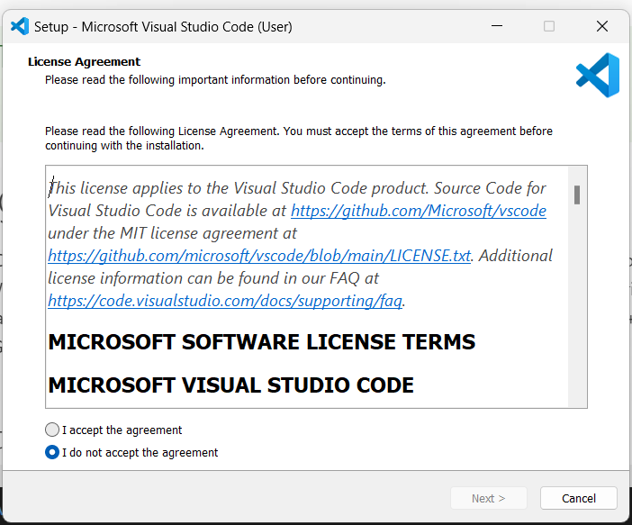
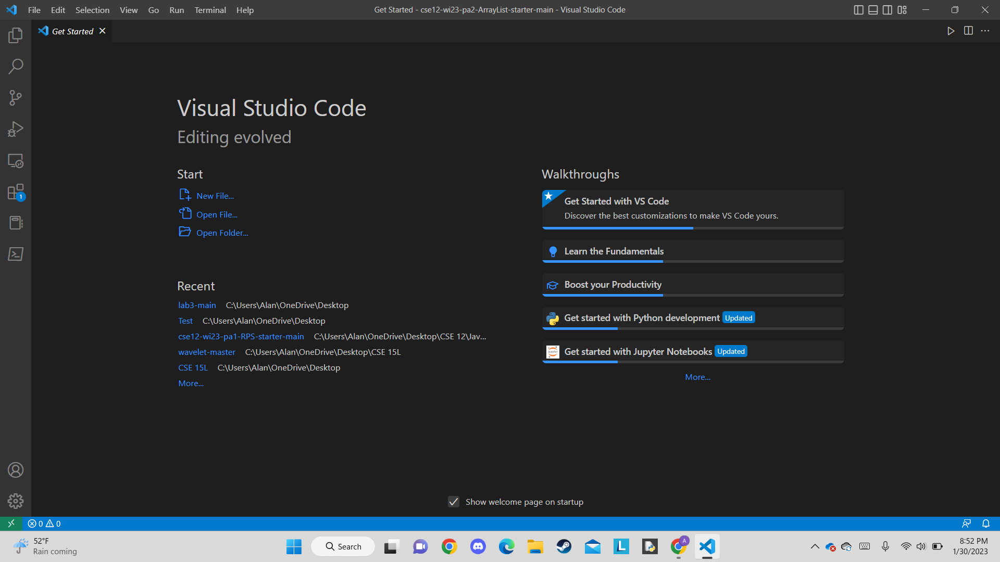
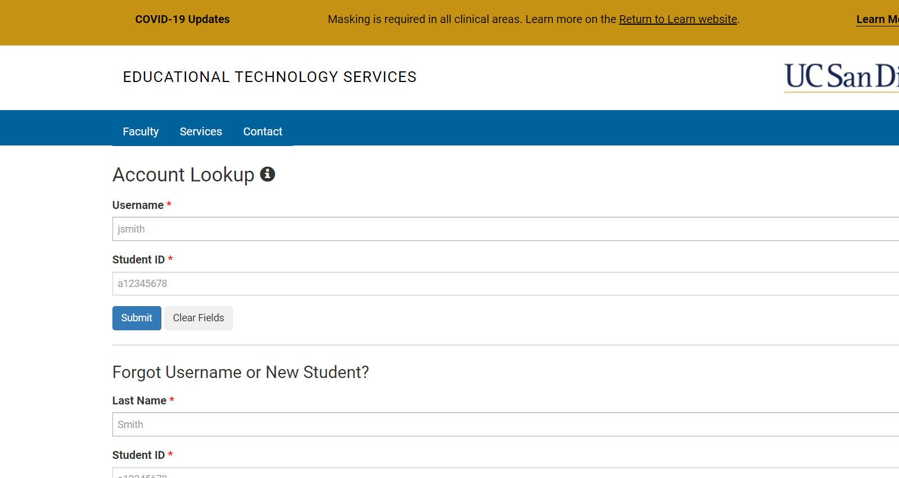
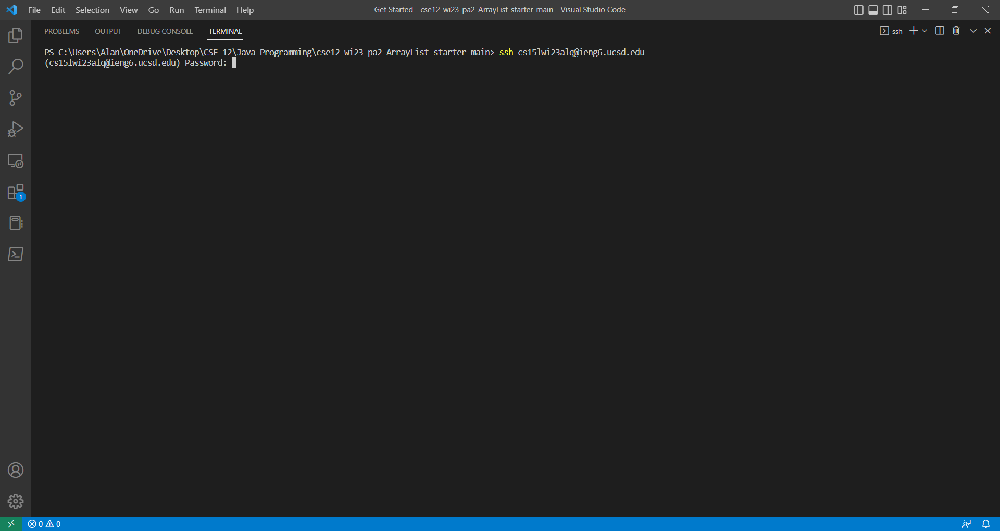

# Installing VS Code
You can install through the website by clicking the link: [VS Code](https://code.visualstudio.com/download).

After getting the installer, open it and follow the instructions that it provides.

After installing VS Code, open a terminal by clicking terminal from the options near the top

After opening a terminal we are able to remotely connect to our course-specific account on **iegn6**

# Remotely Connecting
In order to connect remotely to our course-specific account, we need to know our account first.
Click [here](https://sdacs.ucsd.edu/~icc/index.php) to search for your account.

Enter your Username, ID number then press submit.

The account should start with "cs15lwi23" followed by a unique portion. Adding @ieng6 will be you account. Make sure that the character after 15 is a lowercase "L". It should look similar to: **cs15lwi23(unique portion)@ieng6**

Afterwards, on the open terminal of VS Code type **ssh** followed by a space and your account. This will prompt for your password.

When entering your password, it will not be displayed. However if you press enter and your password is correct, then you will succesffuly connect. However, if your password is wrong you will be prompt to enter it again.
